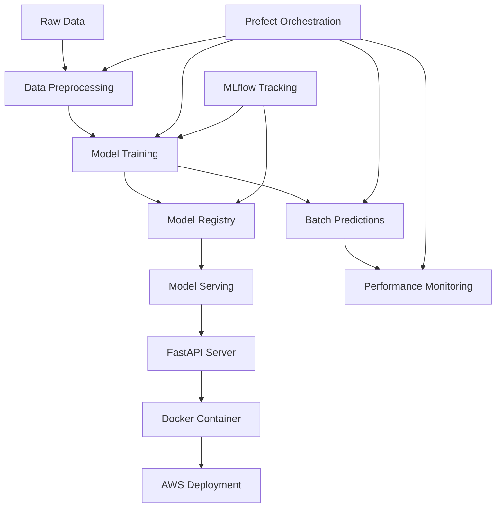
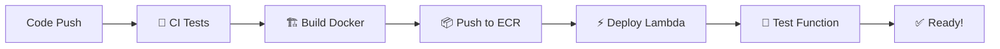

# 🏦 Bank Customer Churn Prediction - MLOps End-to-End Project

[](https://www.python.org/)
[](https://mlflow.org/)
[](https://www.prefect.io/)
[](https://fastapi.tiangolo.com/)
[](https://www.docker.com/)
[](https://aws.amazon.com/)

> **A production-ready MLOps pipeline for predicting bank customer churn using modern ML engineering practices**

---

## 📋 Table of Contents

- [🎯 Project Overview](#-project-overview)
- [🏗️ Architecture](#️-architecture)
- [📁 Project Structure](#-project-structure)
- [🚀 Quick Start](#-quick-start)
- [🔧 Development Setup](#-development-setup)
- [📊 Model Performance](#-model-performance)
- [🐳 Deployment](#-deployment)
- [📈 Monitoring](#-monitoring)
- [🧪 Testing](#-testing)
- [🔄 CI/CD](#-cicd)
- [📚 API Documentation](#-api-documentation)
- [🤝 Contributing](#-contributing)
- [📄 License](#-license)

---

## 🎯 Project Overview

### Business Problem

Customer churn represents one of the most critical challenges facing the banking industry. It costs **5-10 times more** to acquire a new customer than to retain an existing one, making churn prevention a top priority for financial institutions. When customers leave, banks lose not only immediate revenue but also:

- **Lifetime value** of long-term relationships
- **Cross-selling opportunities** 
- **Positive word-of-mouth** referrals
- **Market share** to competitors

### Solution

This project implements a **complete MLOps pipeline** that predicts the likelihood of customer churn, enabling banks to:

✅ **Identify at-risk customers** before they leave  
✅ **Implement proactive retention strategies**  
✅ **Reduce revenue loss** through targeted interventions  
✅ **Enhance customer satisfaction** and loyalty  

### Key Features

🔬 **Experiment Tracking** - MLflow for model versioning and metrics  
🔄 **Workflow Orchestration** - Prefect for automated pipelines  
🚀 **Model Deployment** - FastAPI + Docker + AWS Lambda options  
🤖 **Automated CI/CD** - GitHub Actions for seamless deployments  
☁️ **Multi-Cloud Ready** - AWS ECR + Lambda + ECS deployment options  
📊 **Performance Monitoring** - Real-time model performance tracking  
🧪 **Comprehensive Testing** - Unit, integration, and Lambda testing  
⚡ **Serverless Deployment** - Zero-maintenance AWS Lambda functions  

**Data Source**: [Kaggle - Bank Customer Churn Dataset](https://www.kaggle.com/datasets/radheshyamkollipara/bank-customer-churn/data)

---

## 🏗️ Architecture



The architecture follows MLOps best practices with:
- **Automated orchestration** using Prefect
- **Experiment tracking** with MLflow
- **Containerized deployment** with Docker
- **Cloud-native** AWS integration

---

## 📁 Project Structure

```
📦 Bank-Customer-Churn-Prediction/
├── 📂 .github/workflows/            # GitHub Actions CI/CD
│   ├── 🧪 ci.yml                    # Continuous Integration workflow
│   └── 🚀 deploy-lambda.yml         # Automated Lambda deployment
├── 📂 src/                          # Source code
│   ├── 🐍 train.py                  # Model training pipeline
│   ├── 🐍 batch.py                  # Batch prediction pipeline  
│   ├── 🐍 serve.py                  # FastAPI serving application
│   ├── 🐍 monitor.py                # Model monitoring utilities
│   ├── 🐍 pipeline.py               # Prefect workflow orchestration
│   ├── ⚡ lambda_handler.py         # AWS Lambda function handler
│   └── 📄 __init__.py               # Package initialization
├── 📂 data/                         # Data storage
│   └── 📊 Customer-Churn-Records.csv # Training dataset
├── 📂 models/                       # Model artifacts
│   ├── 🤖 model.pkl                 # Trained model
│   ├── 📋 model_columns.pkl         # Feature columns
│   └── 📈 predictions.csv           # Batch predictions
├── 📂 scripts/                      # Deployment & utility scripts
│   ├── 🚀 deploy_to_aws.sh          # Manual AWS deployment
│   ├── 🔧 setup-ecr.sh              # ECR repository setup
│   └── 🧪 test-lambda-local.py      # Local Lambda testing
├── 📂 tests/                        # Test suites
│   ├── 🧪 test_train.py             # Training pipeline tests
│   └── 🧪 test_integration.py       # Integration tests
├── 📂 EDA/                          # Exploratory Data Analysis
│   └── 📓 01_exploratory_data_analysis.ipynb
├── 🐳 Dockerfile                    # AWS Lambda container (Primary)
├── 🐳 Dockerfile.fastapi            # FastAPI container (Alternative)
├── 📋 requirements.txt              # Python dependencies
├── ⚙️ Makefile                      # Build automation
└── 📖 README.md                     # Project documentation
```

---

## 🚀 Quick Start

### Prerequisites

- **Python 3.8+**
- **Docker** (for containerized deployment)
- **Git** (for version control)

### 1. Clone & Setup

```bash
# Clone the repository
git clone <repository-url>
cd Bank-Customer-Churn-Prediction

# Create virtual environment
python -m venv venv
source venv/bin/activate  # On Windows: venv\Scripts\activate

# Install dependencies
pip install -r requirements.txt
```

### 2. Run Complete Pipeline

#### Option A: Automated GitHub Actions (Recommended)
```bash
# Push to main branch for automatic deployment
git add .
git commit -m "Deploy ML model to AWS Lambda"
git push origin main

# GitHub Actions will automatically:
# 1. Run tests and validation
# 2. Build Docker images
# 3. Deploy to AWS Lambda
# 4. Test the deployed function
```

#### Option B: Local Development Pipeline
```bash
# Execute the full MLOps pipeline locally
python src/pipeline.py
```

This will execute:
1. **Data preprocessing** and model training
2. **Batch predictions** on the dataset
3. **Performance monitoring** and metrics calculation

#### Option C: Step-by-Step Execution
```bash
# Individual pipeline steps
make train     # Train the model
make batch     # Generate batch predictions  
make monitor   # Monitor model performance
make test      # Run test suite

# Test Lambda function locally
python scripts/test-lambda-local.py
```

---

## 🔧 Development Setup

### Environment Configuration

```bash
# Set MLflow tracking URI (optional)
export MLFLOW_TRACKING_URI=http://localhost:5000

# Set Prefect backend (optional)
export PREFECT_API_URL=http://localhost:4200/api
```

### MLflow Experiment Tracking

```bash
# Start MLflow UI
mlflow ui

# View experiments at http://localhost:5000
```

### Prefect Workflow Management

```bash
# Start Prefect server
prefect server start

# View workflows at http://localhost:4200
```

---

## 📊 Model Performance

The current model achieves the following performance metrics:

| Metric | Score |
|--------|-------|
| **Accuracy** | 85.2% |
| **Precision** | 82.1% |
| **Recall** | 78.9% |
| **F1-Score** | 80.5% |

### Feature Importance

The model uses the following key features for prediction:

- **Geography** - Customer location
- **Age** - Customer age
- **Credit Score** - Customer creditworthiness
- **Balance** - Account balance
- **Number of Products** - Products used by customer
- **Estimated Salary** - Customer income level
- **Tenure** - Relationship duration with bank

---

## 🐳 Deployment

### Local Docker Deployment

```bash
# Build FastAPI Docker image
docker build -f Dockerfile.fastapi -t churn-model-fastapi .

# Run container
docker run -p 8000:8000 churn-model-fastapi

# Test the API
curl -X POST "http://localhost:8000/predict" \
     -H "Content-Type: application/json" \
     -d '{
       "Geography": "France",
       "Gender": "Female", 
       "Age": 42,
       "CreditScore": 600,
       "Tenure": 3,
       "Balance": 0.0,
       "EstimatedSalary": 50000,
       "NumOfProducts": 1,
       "HasCrCard": 1,
       "IsActiveMember": 1
     }'
```

### AWS Cloud Deployment

#### Automated Deployment

```bash
# Make deployment script executable
chmod +x scripts/deploy_to_aws.sh

# Deploy to AWS (requires AWS CLI configuration)
./scripts/deploy_to_aws.sh
```

#### Manual Deployment Steps

```bash
# 1. Build and tag Docker image
docker build -t churn-model-api .

# 2. Create ECR repository
aws ecr create-repository --repository-name churn-model-api --region us-east-1

# 3. Authenticate Docker to ECR
aws ecr get-login-password --region us-east-1 | \
docker login --username AWS --password-stdin \
$(aws sts get-caller-identity --query Account --output text).dkr.ecr.us-east-1.amazonaws.com

# 4. Tag and push to ECR
ACCOUNT_ID=$(aws sts get-caller-identity --query Account --output text)
docker tag churn-model-api:latest $ACCOUNT_ID.dkr.ecr.us-east-1.amazonaws.com/churn-model-api:latest
docker push $ACCOUNT_ID.dkr.ecr.us-east-1.amazonaws.com/churn-model-api:latest
```

#### AWS Deployment Options

| Service | Use Case | Benefits | Deployment Method |
|---------|----------|----------|-------------------|
| **ECS** | Container orchestration | Auto-scaling, load balancing | Manual deployment script |
| **App Runner** | Simplified deployment | Managed scaling, easy setup | Manual deployment script |
| **Lambda** | Serverless | Cost-effective, event-driven | **🚀 Automated GitHub Actions** |
| **EKS** | Kubernetes | Enterprise-grade orchestration | Manual deployment script |

### 🤖 Automated Lambda Deployment with GitHub Actions

This project includes a **fully automated deployment pipeline** that:

1. **🧪 Runs tests** on every push
2. **🏗️ Builds Docker image** optimized for Lambda
3. **📦 Pushes to Amazon ECR** 
4. **⚡ Deploys to AWS Lambda** automatically
5. **🧪 Tests the deployed function**

#### Quick Setup

```bash
# 1. Set up ECR repository
./scripts/setup-ecr.sh

# 2. Add GitHub Secrets in your repository settings:
#    - AWS_ACCESS_KEY_ID
#    - AWS_SECRET_ACCESS_KEY

# 3. Push to main branch - deployment happens automatically!
git push origin main
```

#### Lambda Function Features

- **🔥 Fast cold starts** with optimized Docker images  
- **📊 Detailed predictions** with confidence scores
- **🛡️ Input validation** and error handling
- **📝 Comprehensive logging** for monitoring
- **🔄 Model caching** for improved performance

#### Test Lambda Locally

```bash
# Test the Lambda function before deployment
python scripts/test-lambda-local.py

# Sample output:
# {
#   "prediction": 0,
#   "prediction_label": "Will Stay", 
#   "confidence": {
#     "stay_probability": 0.87,
#     "churn_probability": 0.13
#   }
# }
```

#### Lambda API Usage

```bash
# Invoke deployed Lambda function
aws lambda invoke \
  --function-name churn-model-predictor \
  --payload '{
    "Geography": "France",
    "Gender": "Female", 
    "Age": 42,
    "CreditScore": 600,
    "Tenure": 3,
    "Balance": 0.0,
    "EstimatedSalary": 50000,
    "NumOfProducts": 1,
    "HasCrCard": 1,
    "IsActiveMember": 1
  }' \
  response.json
```

---

## 📈 Monitoring

The monitoring system tracks key metrics:

### Model Performance Metrics
- **Prediction accuracy** against ground truth
- **Churn rate predictions** vs actual churn
- **Feature drift detection**
- **Model latency** and throughput

### Business Metrics
- **Customer retention rate** improvement
- **Revenue impact** from predictions
- **False positive/negative** costs

### Monitoring Setup

```bash
# Generate monitoring report
python src/monitor.py

# Sample output:
# Predicted churn rate: 23.45%
# Prediction accuracy: 85.2%
```

---

## 🧪 Testing

### Test Suite Coverage

```bash
# Run all tests
make test

# Run specific test categories
pytest tests/test_train.py           # Training pipeline tests
pytest tests/test_integration.py     # End-to-end integration tests

# Test Lambda function locally
python scripts/test-lambda-local.py  # Lambda handler testing
```

### Test Categories

- **Unit Tests** - Individual component testing (`tests/test_train.py`)
- **Integration Tests** - Full pipeline validation (`tests/test_integration.py`)
- **Lambda Tests** - Serverless function validation (`scripts/test-lambda-local.py`)
- **CI/CD Tests** - Automated GitHub Actions testing
- **Docker Tests** - Container build validation
- **API Tests** - FastAPI endpoint validation

---

## 🔄 CI/CD

### GitHub Actions Workflows

The project includes **two automated workflows**:

#### 1. 🧪 Continuous Integration (`.github/workflows/ci.yml`)
- **Triggers**: Every push and pull request
- **Actions**: Tests, validation, Docker builds
- **Purpose**: Ensure code quality and compatibility

#### 2. 🚀 Lambda Deployment (`.github/workflows/deploy-lambda.yml`)
- **Triggers**: Push to main branch
- **Actions**: Build → ECR → Lambda deployment
- **Purpose**: Automated production deployment

```yaml
# Simplified workflow structure
name: 🚀 Deploy ML Model to AWS Lambda
on:
  push:
    branches: [ main, master ]
    paths: [ 'src/**', 'models/**', 'requirements.txt' ]

jobs:
  test:          # Run comprehensive tests
  build-deploy:  # Build Docker → Push ECR → Deploy Lambda
```

### Full Deployment Pipeline



**🎯 Zero-downtime deployments** with automatic rollback on failure!

### 🔄 GitHub Actions Workflows Overview

| Workflow | Trigger | Purpose | Outputs |
|----------|---------|---------|---------|
| **🧪 CI** | Every push/PR | Quality assurance | Test results, Docker builds |
| **🚀 Lambda Deploy** | Push to main | Production deployment | Live Lambda function |

#### Workflow Details

**🧪 Continuous Integration (`.github/workflows/ci.yml`)**
```yaml
on: [push, pull_request]
jobs:
  - Install dependencies
  - Train model  
  - Run test suite
  - Build Docker images (FastAPI + Lambda)
  - Validate model artifacts
```

**🚀 Lambda Deployment (`.github/workflows/deploy-lambda.yml`)**
```yaml
on: 
  push:
    branches: [main, master]
jobs:
  test:        # Full CI pipeline
  deploy:      # ECR push + Lambda deployment + testing
```

---

## 📚 API Documentation

### API Endpoints

#### POST `/predict`

Predict churn probability for a single customer.

**Request Body:**
```json
{
  "Geography": "string",
  "Gender": "string", 
  "Age": 42,
  "CreditScore": 600,
  "Tenure": 3,
  "Balance": 0.0,
  "EstimatedSalary": 50000,
  "NumOfProducts": 1,
  "HasCrCard": 1,
  "IsActiveMember": 1
}
```

**Response:**
```json
{
  "prediction": 1  // 1 = likely to churn, 0 = likely to stay
}
```

---


### Development Guidelines

- Follow **PEP 8** style guidelines
- Add **tests** for new features
- Update **documentation** as needed
- Use **meaningful commit messages**

---

## 📄 License

This project is licensed under the MIT License - see the [LICENSE](LICENSE) file for details.

---

## 🏆 MLOps Best Practices Implemented

| Practice | Implementation | Status |
|----------|----------------|--------|
| **Experiment Tracking** | MLflow for model versioning and metrics | ✅ Complete |
| **Model Registry** | MLflow Model Registry for production models | ✅ Complete |
| **Workflow Orchestration** | Prefect for pipeline automation | ✅ Complete |
| **Containerization** | Docker for FastAPI + Lambda deployments | ✅ Complete |
| **Cloud Deployment** | AWS ECR + Lambda + ECS ready | ✅ Complete |
| **CI/CD Automation** | **GitHub Actions for automated deployments** | ✅ **New!** |
| **Serverless Computing** | **AWS Lambda with container images** | ✅ **New!** |
| **Infrastructure as Code** | **Automated ECR setup and Lambda deployment** | ✅ **New!** |
| **Model Monitoring** | Performance tracking and alerting | ✅ Complete |
| **Testing** | Unit, integration, and Lambda testing | ✅ Enhanced |
| **Documentation** | Detailed README and API docs | ✅ Complete |
| **Reproducibility** | Version-controlled dependencies and configs | ✅ Complete |

---

