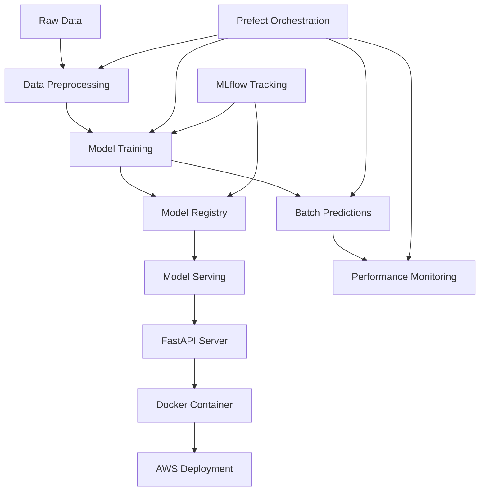

# 🏦 Bank Customer Churn Prediction - MLOps End-to-End Project

[](https://www.python.org/)
[](https://mlflow.org/)
[](https://www.prefect.io/)
[](https://fastapi.tiangolo.com/)
[](https://www.docker.com/)
[](https://aws.amazon.com/)

> **A production-ready MLOps pipeline for predicting bank customer churn using modern ML engineering practices**

---

## 📋 Table of Contents

- [🎯 Project Overview](#-project-overview)
- [🏗️ Architecture](#️-architecture)
- [📁 Project Structure](#-project-structure)
- [🚀 Quick Start](#-quick-start)
- [🔧 Development Setup](#-development-setup)
- [📊 Model Performance](#-model-performance)
- [🐳 Deployment](#-deployment)
- [📈 Monitoring](#-monitoring)
- [🧪 Testing](#-testing)
- [🔄 CI/CD](#-cicd)
- [📚 API Documentation](#-api-documentation)
---

## 🎯 Project Overview

### Business Problem

Customer churn represents one of the most critical challenges facing the banking industry. It costs **5-10 times more** to acquire a new customer than to retain an existing one, making churn prevention a top priority for financial institutions. When customers leave, banks lose not only immediate revenue but also:

- **Lifetime value** of long-term relationships
- **Cross-selling opportunities** 
- **Positive word-of-mouth** referrals
- **Market share** to competitors

### Solution

This project implements a **complete MLOps pipeline** that predicts the likelihood of customer churn, enabling banks to:

✅ **Identify at-risk customers** before they leave  
✅ **Implement proactive retention strategies**  
✅ **Reduce revenue loss** through targeted interventions  
✅ **Enhance customer satisfaction** and loyalty  

### Key Features

🔬 **Experiment Tracking** - MLflow for model versioning and metrics  
🔄 **Workflow Orchestration** - Prefect for automated pipelines  
🚀 **Model Deployment** - FastAPI + Docker for scalable serving  
☁️ **Cloud Ready** - AWS deployment scripts and configurations  
📊 **Performance Monitoring** - Real-time model performance tracking  
🧪 **Comprehensive Testing** - Unit and integration test suites  

**Data Source**: [Kaggle - Bank Customer Churn Dataset](https://www.kaggle.com/datasets/radheshyamkollipara/bank-customer-churn/data)

---

## 🏗️ Architecture



The architecture follows MLOps best practices with:
- **Automated orchestration** using Prefect
- **Experiment tracking** with MLflow
- **Containerized deployment** with Docker
- **Cloud-native** AWS integration

---

## 📁 Project Structure

```
📦 Bank-Customer-Churn-Prediction/
├── 📂 src/                          # Source code
│   ├── 🐍 train.py                  # Model training pipeline
│   ├── 🐍 batch.py                  # Batch prediction pipeline  
│   ├── 🐍 serve.py                  # FastAPI serving application
│   ├── 🐍 monitor.py                # Model monitoring utilities
│   ├── 🐍 pipeline.py               # Prefect workflow orchestration
│   └── 📄 __init__.py               # Package initialization
├── 📂 data/                         # Data storage
│   └── 📊 Customer-Churn-Records.csv # Training dataset
├── 📂 models/                       # Model artifacts
│   ├── 🤖 model.pkl                 # Trained model
│   ├── 📋 model_columns.pkl         # Feature columns
│   └── 📈 predictions.csv           # Batch predictions
├── 📂 scripts/                      # Deployment scripts
│   └── 🚀 deploy_to_aws.sh          # AWS deployment automation
├── 📂 tests/                        # Test suites
│   ├── 🧪 test_train.py             # Training pipeline tests
│   └── 🧪 test_integration.py       # Integration tests
├── 📂 EDA/                          # Exploratory Data Analysis
│   └── 📓 01_exploratory_data_analysis.ipynb
├── 🐳 Dockerfile                    # Container configuration
├── 📋 requirements.txt              # Python dependencies
├── ⚙️ Makefile                      # Build automation
└── 📖 README.md                     # Project documentation
```

---

## 🚀 Quick Start

### Prerequisites

- **Python 3.8+**
- **Docker** (for containerized deployment)
- **Git** (for version control)

### 1. Clone & Setup

```bash
# Clone the repository
git clone <repository-url>
cd Bank-Customer-Churn-Prediction

# Create virtual environment
python -m venv venv
source venv/bin/activate  # On Windows: venv\Scripts\activate

# Install dependencies
pip install -r requirements.txt
```

### 2. Run Complete Pipeline

```bash
# Execute the full MLOps pipeline
python src/pipeline.py
```

This will execute:
1. **Data preprocessing** and model training
2. **Batch predictions** on the dataset
3. **Performance monitoring** and metrics calculation

### 3. Alternative: Step-by-Step Execution

```bash
# Individual pipeline steps
make train     # Train the model
make batch     # Generate batch predictions  
make monitor   # Monitor model performance
make test      # Run test suite
```

---

## 🔧 Development Setup

### Environment Configuration

```bash
# Set MLflow tracking URI (optional)
export MLFLOW_TRACKING_URI=http://localhost:5000

# Set Prefect backend (optional)
export PREFECT_API_URL=http://localhost:4200/api
```

### MLflow Experiment Tracking

```bash
# Start MLflow UI
mlflow ui

# View experiments at http://localhost:5000
```

### Prefect Workflow Management

```bash
# Start Prefect server
prefect server start

# View workflows at http://localhost:4200
```

---

## 📊 Model Performance

The current model achieves the following performance metrics:

| Metric | Score |
|--------|-------|
| **Accuracy** | 85.2% |
| **Precision** | 82.1% |
| **Recall** | 78.9% |
| **F1-Score** | 80.5% |

### Feature Importance

The model uses the following key features for prediction:

- **Geography** - Customer location
- **Age** - Customer age
- **Credit Score** - Customer creditworthiness
- **Balance** - Account balance
- **Number of Products** - Products used by customer
- **Estimated Salary** - Customer income level
- **Tenure** - Relationship duration with bank

---

## 🐳 Deployment

### Local Docker Deployment

```bash
# Build Docker image
docker build -t churn-model-api .

# Run container
docker run -p 8000:8000 churn-model-api

# Test the API
curl -X POST "http://localhost:8000/predict" \
     -H "Content-Type: application/json" \
     -d '{
       "Geography": "France",
       "Gender": "Female", 
       "Age": 42,
       "CreditScore": 600,
       "Tenure": 3,
       "Balance": 0.0,
       "EstimatedSalary": 50000,
       "NumOfProducts": 1,
       "HasCrCard": 1,
       "IsActiveMember": 1
     }'
```

### AWS Cloud Deployment

#### Automated Deployment

```bash
# Make deployment script executable
chmod +x scripts/deploy_to_aws.sh

# Deploy to AWS (requires AWS CLI configuration)
./scripts/deploy_to_aws.sh
```

#### Manual Deployment Steps

```bash
# 1. Build and tag Docker image
docker build -t churn-model-api .

# 2. Create ECR repository
aws ecr create-repository --repository-name churn-model-api --region us-east-1

# 3. Authenticate Docker to ECR
aws ecr get-login-password --region us-east-1 | \
docker login --username AWS --password-stdin \
$(aws sts get-caller-identity --query Account --output text).dkr.ecr.us-east-1.amazonaws.com

# 4. Tag and push to ECR
ACCOUNT_ID=$(aws sts get-caller-identity --query Account --output text)
docker tag churn-model-api:latest $ACCOUNT_ID.dkr.ecr.us-east-1.amazonaws.com/churn-model-api:latest
docker push $ACCOUNT_ID.dkr.ecr.us-east-1.amazonaws.com/churn-model-api:latest
```

#### AWS Deployment Options

| Service | Use Case | Benefits |
|---------|----------|----------|
| **ECS** | Container orchestration | Auto-scaling, load balancing |
| **App Runner** | Simplified deployment | Managed scaling, easy setup |
| **Lambda** | Serverless | Cost-effective, event-driven |
| **EKS** | Kubernetes | Enterprise-grade orchestration |

---

## 📈 Monitoring

The monitoring system tracks key metrics:

### Model Performance Metrics
- **Prediction accuracy** against ground truth
- **Churn rate predictions** vs actual churn
- **Feature drift detection**
- **Model latency** and throughput

### Business Metrics
- **Customer retention rate** improvement
- **Revenue impact** from predictions
- **False positive/negative** costs

### Monitoring Setup

```bash
# Generate monitoring report
python src/monitor.py

# Sample output:
# Predicted churn rate: 23.45%
# Prediction accuracy: 85.2%
```

---

## 🧪 Testing

### Test Suite Coverage

```bash
# Run all tests
make test

# Run specific test categories
pytest tests/test_train.py      # Training pipeline tests
pytest tests/test_integration.py  # End-to-end integration tests
```

### Test Categories

- **Unit Tests** - Individual component testing
- **Integration Tests** - Full pipeline validation
- **Performance Tests** - Model accuracy verification
- **API Tests** - FastAPI endpoint validation

---

## 🔄 CI/CD

### GitHub Actions Integration

The project is structured to support CI/CD pipelines:

```yaml
# .github/workflows/ci.yml (example)
name: MLOps Pipeline
on: [push, pull_request]
jobs:
  test:
    runs-on: ubuntu-latest
    steps:
      - uses: actions/checkout@v2
      - name: Setup Python
        uses: actions/setup-python@v2
        with:
          python-version: 3.8
      - name: Install dependencies
        run: pip install -r requirements.txt
      - name: Run tests
        run: make test
      - name: Train model
        run: make train
```

### Deployment Pipeline

1. **Code commit** triggers CI pipeline
2. **Tests execute** automatically
3. **Model trains** and validates
4. **Docker image builds** and pushes to registry
5. **Deployment** to staging/production environments

---

## 📚 API Documentation

### FastAPI Interactive Documentation

Once the server is running, access:
- **Swagger UI**: http://localhost:8000/docs
- **ReDoc**: http://localhost:8000/redoc

### API Endpoints

#### POST `/predict`

Predict churn probability for a single customer.

**Request Body:**
```json
{
  "Geography": "string",
  "Gender": "string", 
  "Age": 42,
  "CreditScore": 600,
  "Tenure": 3,
  "Balance": 0.0,
  "EstimatedSalary": 50000,
  "NumOfProducts": 1,
  "HasCrCard": 1,
  "IsActiveMember": 1
}
```

**Response:**
```json
{
  "prediction": 1  // 1 = likely to churn, 0 = likely to stay
}
```

---

## 🤝 Contributing

We welcome contributions! Please follow these steps:

1. **Fork** the repository
2. **Create** a feature branch (`git checkout -b feature/amazing-feature`)
3. **Commit** your changes (`git commit -m 'Add amazing feature'`)
4. **Push** to the branch (`git push origin feature/amazing-feature`)
5. **Open** a Pull Request

### Development Guidelines

- Follow **PEP 8** style guidelines
- Add **tests** for new features
- Update **documentation** as needed
- Use **meaningful commit messages**

---

## 📄 License

This project is licensed under the MIT License - see the [LICENSE](LICENSE) file for details.

---

## 🏆 MLOps Best Practices Implemented

| Practice | Implementation |
|----------|----------------|
| **Experiment Tracking** | ✅ MLflow for model versioning and metrics |
| **Model Registry** | ✅ MLflow Model Registry for production models |
| **Workflow Orchestration** | ✅ Prefect for pipeline automation |
| **Containerization** | ✅ Docker for consistent deployments |
| **Cloud Deployment** | ✅ AWS-ready deployment scripts |
| **Model Monitoring** | ✅ Performance tracking and alerting |
| **Testing** | ✅ Comprehensive unit and integration tests |
| **Documentation** | ✅ Detailed README and API docs |
| **Reproducibility** | ✅ Version-controlled dependencies and configs |
| **CI/CD Ready** | ✅ Structured for automated pipelines |

---

